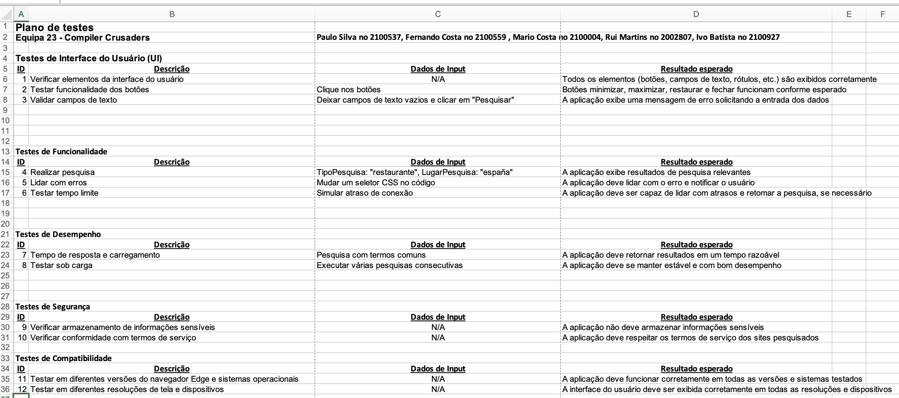

<h1 align="center">
    
</h1>

Minuta para plano de testes

📌 Minuta para plano de testes
------------------

Foi feito em Excel.

Was done with Excel.

🔧 Tecnologias utilizadas:
------------------

- Excel

💬 Fale com Compiler Crusaders
------------------
[*Entre em contato com a equipa*](https://teams.microsoft.com/l/entity/2a527703-1f6f-4559-a332-d8a7d288cd88/_djb2_msteams_prefix_4226427084?context=%7B%22subEntityId%22%3Anull%2C%22channelId%22%3A%2219%3ABsxbN8saoth3fKmRHKYl0gyfaUGiT4g3YisMGUEtW0U1%40thread.tacv2%22%7D&groupId=f20cc04f-8389-4991-b8b2-3b82ac420080&tenantId=58e31257-f77f-4d58-9705-d0b6ea0f9ee4&allowXTenantAccess=false)

